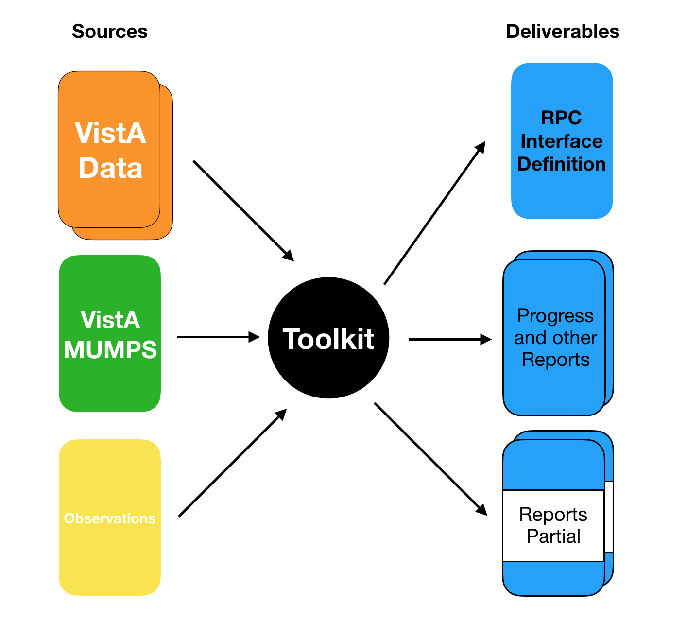
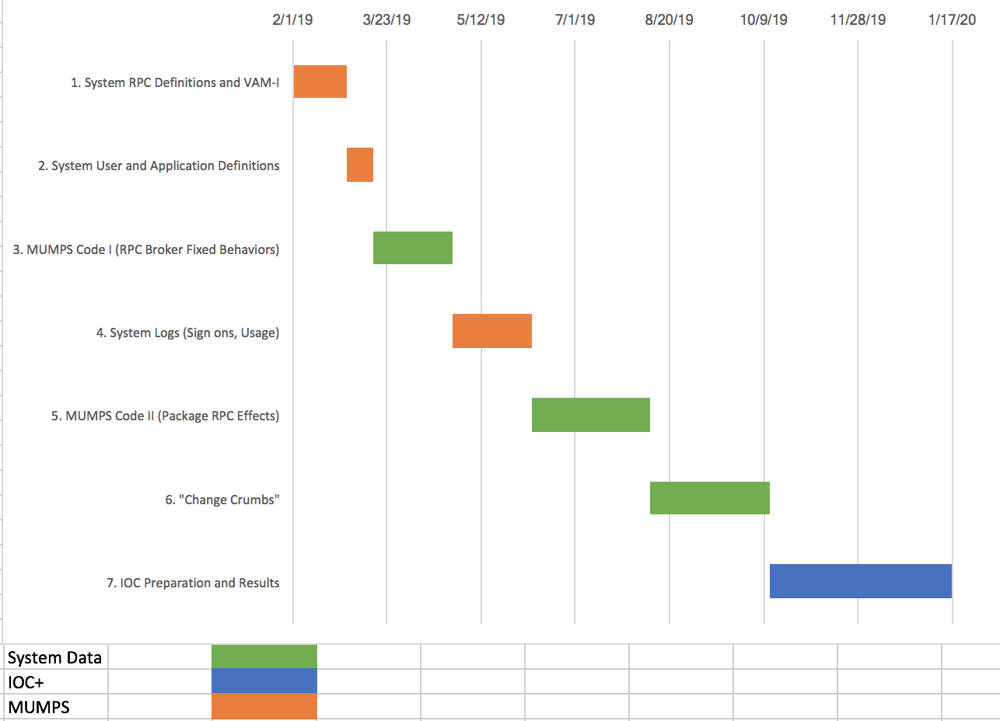

# RPC Definition and Toolkit

_Toolkit/Definition_ is one of three development areas for VAM-II. The other two are _RPC Classifier/Monitor_ and _VAEC Deploy/CloudWatch_. Specifically, the Toolkit is ...

> for producing a machine-readable definition (__"RPC Interface Definition"__) and human-readable reports of VA VistA's RPC interface covering individual RPCs, Application and User types (__"RPC Interface Definition"__) to __enable intelligent Auditing and Alerting__ of any and all VA VistAs by a Cloud-based interface monitor.

The Toolkit's outputs will address four of the five deliverables called out in PWS 5.2 _Adaptive Maintainence Services_:
  * _Comprehensive RPC Interface Audit Report_
  * _MUMPS RPC to JSON Model Data Definition_ (the _RPC Interface Definition_)
  * _Version Description Document (VDD)_
  * _Security Vulnerability Report_

as well as providing significant input for the _RPC Interface Test Suite_ (PWS 5.3), IOC (PWS 5.5) and Deployment and Release (PWS 5.6) including the latter's _Capacity, Performance and Scalability Assessment_ report.

The Toolkit will produce the _RPC Interface Definition_ and appropriate reports, either completely or in part, from three types of Artifact, _VistA resident data_, _VistA MUMPS code_ or machine definitions of _SME observations_ ...

Work will proceed in seven stages using one or many VistAs ...

Version | Area | VistAs | Weeks | Due Date | Description
--- | --- | --- | --- | --- | ---
__D1__ | System RPC definitions - 8994, 101.24, 19 ... | ALL | 4 | __March 1__ | __Basic Definition of ALL 5500__ and incorporate nuance from VAM-1 for a subset
__D2__ | System User and Application Definitions | Clones | 2 | __March 15th__ | Basic Definition of User and Application (Client) Types
__D3__ | __MUMPS Code I__ (RPC Broker fixed behaviors) | FOIA | 6 | __April 26th__ | Examine and test RPC Broker code to scope [a] RPC Parsing requirements, [b] session recognition and stateful behavior required of the RPC Monitor and [c] vulnerabilities in the existing broker
__D4__ | System Logs (sign ons, usage) | Clones | 6 | __June 7th__ | Analyze the piecemeal logs now in VistA to enhance definitions. This feeds into the _Security Vulnerability Report_, a key deliverable 
__D5__ | __MUMPS Code II__ (Package RPC effects) | FOIA | 9 | __August 9th__ | Enhance individual RPC definitions and develop new test scenarios based on their MUMPS implementations
__D6__ | "Change Crumbs" | 1 Clone | 9 | __October 11th__ | Enhance _CHANGE RPC_ and User definitions based on "crumbs" (who created, when changed) left in FileMan data. Caching of representative Clone data will start early in the project.
__D7__ | _IOC Preparation and Results_ | IOC | - | __January 17__ | during and after IOC, update definitions and reports based on IOC results

  * All 5500 RPCs will be defined by _D1_ and the definitions will gain nuance with each stage. This approach will enable __incremental enhancement, deployment and testing of the RPC Monitor__. Generally the Monitor will support new Interface Definition nuance within 2 to 4 weeks.
    * Note that this differs from the initial tentative plan of definition development in three stages of 1850 RPCs each. 
  * Pre-IOC Definition must be complete by October 11th to give time for RPC Monitor completion before the IOC, scheduled for the fourth quarter of VAM-II.
  * Manual enhancement based on analysis that can't be automated will be captured in a distinct machine-readable definition in order to distinguish the re-generatable
VistA-derived information from manual additions and overrides
  * Initially artifacts will come from FOIA VistA and two VAM-1 Clones, 442 and 640. Later refreshed versions (2019 cuts) of the same clones and a clone of the IOC target VistA will be processed.
    * expect refreshed 442 and 640 by end of VAM-2 Q1 (April 25th). Expect IOC Target Clone one month later?
  * The toolkit will generate human-readable, markdown-formatted documentation of RPC, Application and User types. It will also generate a series of custom reports to summarize major functionality and patterns of the interface and its users.
    * many of the generated summaries will make PWS deliverables including all or portions of the _Comprehensive RPC Interface Audit Report_, the _Version Description Document (VDD) Definition_, the _Security Vulnerability Report_ and the _Capacity, Performance and Scalability Assessment_.
