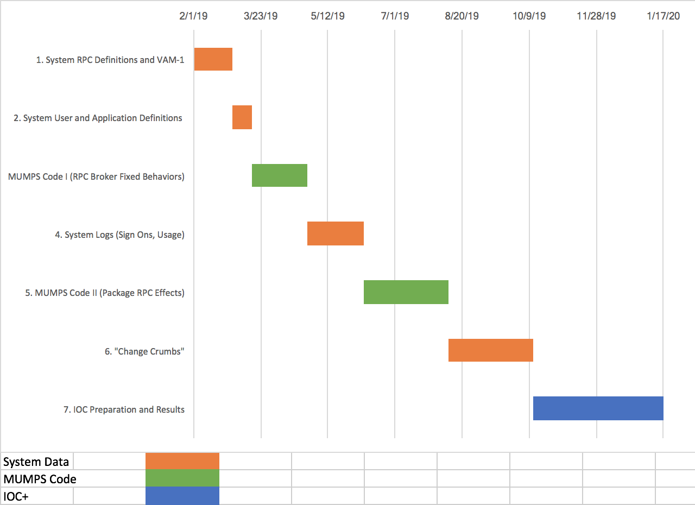

# RPCDefinitionToolkit

> A toolkit for producing a __machine-readable definition__ of VistA's RPC interface covering individual RPCs, Application and User types (__"RPC Interface Definition"__) to __enable intelligent Auditing and Alerting__ of any and all VA VistAs by a Cloud-based interface monitor.

The _RPC Interface Definition_ will be produced in six stages, each focused on processing and analyzing different artifacts. Artifacts are either __VistA-resident Data Definitions__ or __VistA MUMPS code__.

Version | Area | VistAs | Weeks | Due Date | Description
--- | --- | --- | --- | --- | ---
__D1__ | System RPC definitions - 8994, 101.24, 19 ... | ALL | 4 | __March 1__ | __Basic Definition of ALL 5500__ and incorporate nuance from VAM-1 for a subset
__D2__ | System User and Application Definitions | Clones | 2 | __March 15th__ | Basic Definition of User and Application (Client) Types
__D3__ | __MUMPS Code I__ (RPC Broker fixed behaviors) | FOIA | 6 | __April 26th__ | Examine and test RPC Broker code to [a] scope RPC Parser and [b] enable Classifier's session recognition and stateful behavior
__D4__ | System Logs (sign ons, usage) | Clones | 6 | __June 7th__ | Use piecemeal logs now in VistA to [a] enhance definitions and [b] ensure they cover at least the scope of these logs 
__D5__ | __MUMPS Code II__ (Package RPC effects) | FOIA | 9 | __August 9th__ | Enhance individual RPC definitions and develop new test scenarios based on their MUMPS implementations
__D6__ | "Change Crumbs" | 1 Clone | 9 | __October 11th__ | Enhance _CHANGE RPC_ definitions based on their trails in FileMan data. Caching of Clone data will start early in the project.

  * Staging is based on __breath first__ (all 5500) with increasingly nuanced definitions enabling __incremental development, deployment and testing of the RPC Monitor__. Generally the Monitor will support new Interface Definition nuance within 2 to 4 weeks.
    * Note that this differs from the initial tentative plan of definition development in three stages of 1850 RPCs each. 
  * Definition should be complete by October 11th giving time for RPC Monitor completion before the IOC which is scheduled for the fourth quarter of VAM-II.
  * Manual enhancement based on analysis that can't be automated will be captured in a distinct machine-readable definition in order to distinguish the re-generatable
VistA-derived information from manual additions and overrides
  * Initially artifacts will come from FOIA VistA and two VAM-1 Clones, 442 and 640. Later refreshed versions (2019 cuts) of the same clones and a clone of the IOC target VistA will be processed.
    * expect refreshed 442 and 640 by end of VAM-2 Q1 (April 25th). Expect IOC Target Clone one month later?
